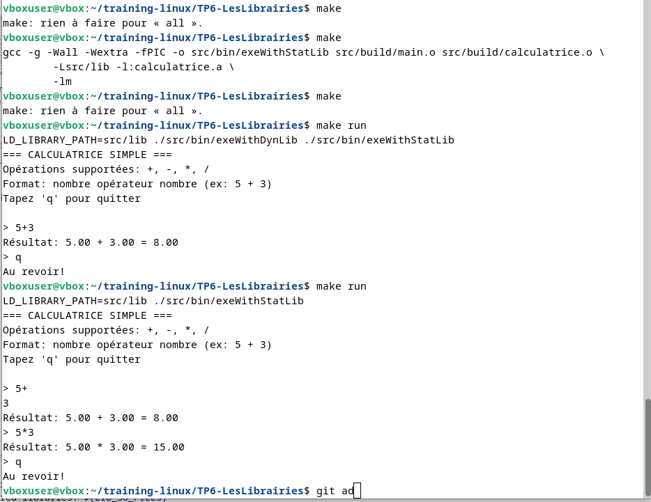
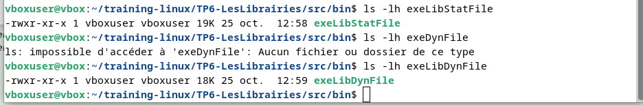
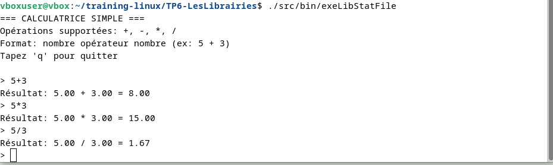
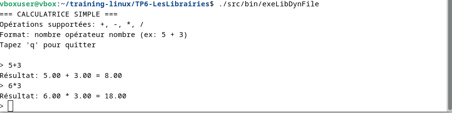

# 🧮 Projet Calculatrice

Dans ce projet nous avons mis en place un programme écrit en C qui permet de faire des opérations suivantes :
- **Arithmétique simple** (+, -, *, /)
---

## Introduction aux librairies statique et dynamique
Un fichier .so est une bibliothèque d'objets partagés dynamiques utilisée par les systèmes d'exploitation comme Linux et Unix, \
tandis qu'un fichier .a (bibliothèque statique) est une collection de fichiers objets statiques. \
La principale différence réside dans la manière dont les bibliothèques sont liées aux applications : les fichiers .so sont chargés à l'exécution,\
permettant le partage des fonctionnalités entre plusieurs programmes, \
tandis que les fichiers .a sont inclus directement dans l'exécutable final lors de la compilation.\

### Fichiers .so (Bibliothèques partagées)
- Liaison dynamique : Les fonctions de la bibliothèque sont appelées à l'exécution, ce qui permet à\ plusieurs programmes d'utiliser la même copie de la bibliothèque en mémoire.
- Format : Elles sont compilées en utilisant la structure ELF (Executable and Linkable Format).\
Utilisation : Courantes dans les systèmes de type Unix/Linux, \
elles permettent une gestion plus efficace de la mémoire et des mises à jour plus simples des bibliothèques sans avoir à recompiler tous les programmes qui les utilisent.

### Fichiers .a (Bibliothèques statiques)
- Liaison statique : Le code de la bibliothèque est directement copié dans le fichier exécutable de\ l'application lors de la compilation.
- Taille : Cela augmente la taille du fichier exécutable car il contient tout le code de la bibliothèque.
- Dépendances : L'application ne dépend plus de la bibliothèque externe après la compilation, car tout le code est intégré.

## 🚀 Commande manuelle pour la compilation associée aux librairies statique

```bash
gcc -g -c src/include/calculatrice.c -o src/build/calculatrice.o
ar rcs src/lib/calculatrice.a src/build/calculatrice.o
gcc -shared -o src/lib/calculatrice.so src/build/calculatrice.o -lm


gcc -g -I./src/include -c src/app/main.c -o src/build/main.o


gcc -g src/build/main.o -o src/bin/exeLibStatFile \
    -L./src/lib -l:calculatrice.a\
    -lm

gcc -g src/build/main.o -o src/bin/exeLibDynFile \
    -I src/lib \
    src/lib/calculatrice.so \
    -lm


 ./src/bin/exeLibStatFile
 ./src/bin/exeLibDynFile

```

## 🚀 Image associée a l'éxécution des Commandes manuelles pour compilation


## 🚀 Image montrant la taille des exécutable associée au librairie statique et dynamique


On constate que sur l'Image que:
- La taille de l'Exécutable intégrant la lib statique est de 19ko et celle associé à \
la lib Dynamique est de 18Ko ce qui démontre que les exécutable utilisant une lib dynamique \
sont plus legère car celle n'integre pas dans leur exécutable la lib dynamique contrairement \
au cas statique qui integre dans son exécutable la lib statique


## 🚀 Résultat




